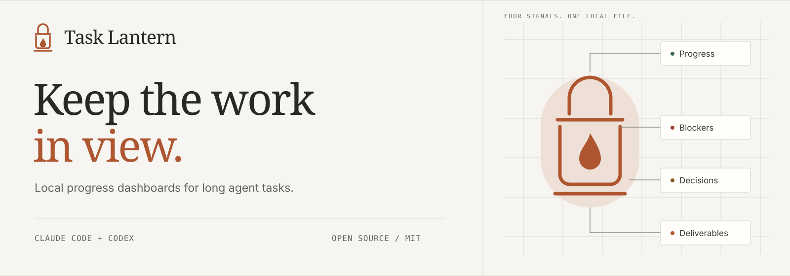
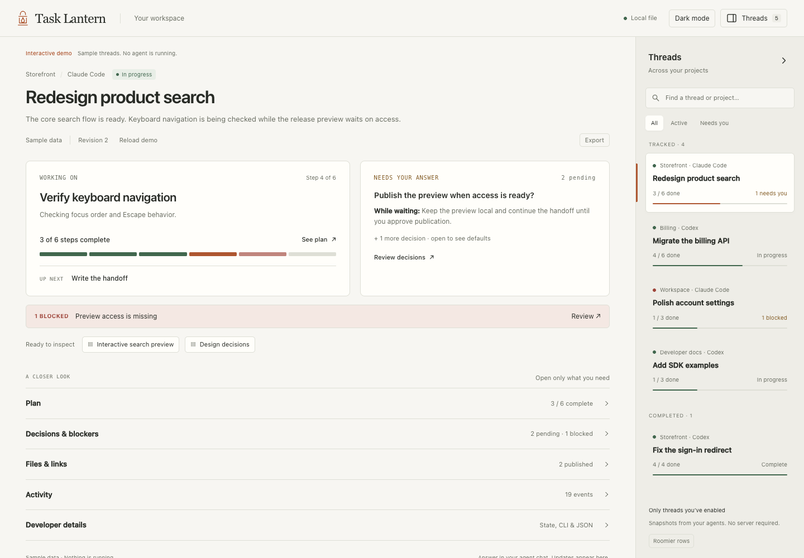
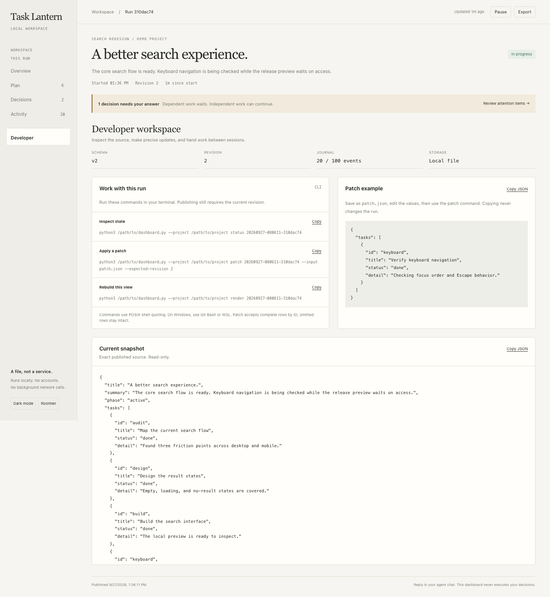
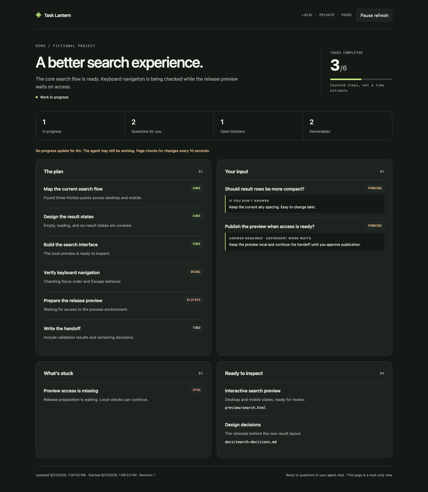
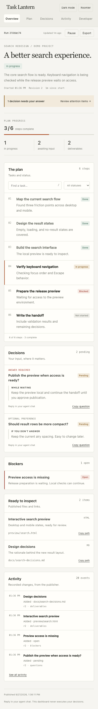
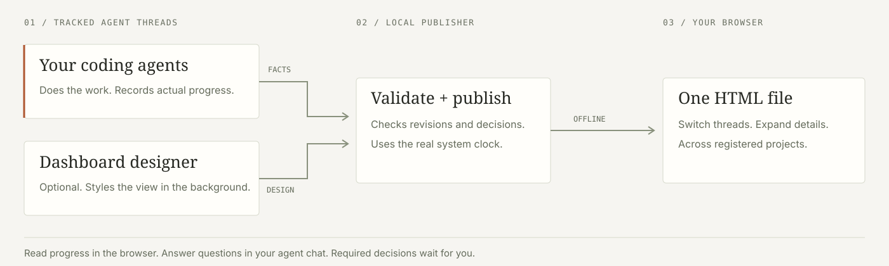

<p align="center">
  
</p>

<p align="center">
  <a href="https://github.com/paranjaymundra/task-lantern/actions/workflows/ci.yml"></a>
  &nbsp; <a href="LICENSE">MIT license</a> &nbsp; · &nbsp; Python 3.10+ &nbsp; · &nbsp; No runtime packages
</p>

<p align="center">
  <a href="#install-once-use-across-projects">Install</a> ·
  <a href="#try-the-demo">Try the demo</a> ·
  <a href="#inside-the-workbench">Features</a> ·
  <a href="docs/installation.md">Setup help</a> ·
  <a href="CONTRIBUTING.md">Contribute</a>
</p>

**One dashboard for every thread you’re tracking.** Task Lantern brings agent-published progress from different projects into one local HTML workspace. Pick a thread in the left sidebar, see what it is working on and what needs you, then expand the details only when you want them.

Keep it beside your editor while Claude Code and Codex work. The summary shows the current step, completed work, questions with defaults, blockers, and recent files. Collapse the sidebar to focus. No server, extra account, or telemetry.



*Real browser capture. The demo task and deliverables are fictional.*

[Watch the 36-second guided walkthrough](brag-output-2026-09-27-141031/brag.mp4) · [Video source and rebuild instructions](brag-output-2026-09-27-141031/README.md)

## Install once, use across projects

You need **Python 3.10+**, a browser with JavaScript, and **Codex or Claude Code**. Global means your user on this machine; each project keeps its authoritative state in `.dashboard/`, and tracked threads appear in one local workspace. Your coding agent’s normal usage costs apply. No `sudo` or `pip install` needed.

### Codex

```sh
git clone https://github.com/paranjaymundra/task-lantern.git
cd task-lantern
python3 scripts/install.py --host codex --scope user --with-agent --apply
```

Start a new Codex session **in your own project**, then prompt:

```text
Use $task-lantern to track this task: [describe your task].
Use dashboard-builder in the background if available. Share the dashboard path.
```

Skills go in `~/.agents/skills/`; the optional designer goes in `~/.codex/agents/`. Omit `--apply` to preview paths, or replace it with `--check` to compare installed files with this checkout. The installer never overwrites existing files.

### Claude Code

```sh
claude plugin marketplace add paranjaymundra/task-lantern
claude plugin install task-lantern@task-lantern-marketplace --scope user
```

Start a new Claude Code session in your project, then prompt:

```text
/task-lantern:task-lantern Track this task: [describe your task].
Use dashboard-builder in the background if available. Share the dashboard path.
```

The plugin includes the skills and designer. The Claude designer uses Opus at medium effort; the main session keeps its own model settings. See [installation options](docs/installation.md) for native Claude skills, project-only installs, or the simpler main-agent workflow.

**Next:** open the `dashboard` path the agent shares. By default it is `~/.local/share/task-lantern/index.html` (`$XDG_DATA_HOME/task-lantern/index.html` when set). Keep this one file open; new tracked threads appear in its left sidebar. Answer questions in your agent chat. For automatic selection on tasks with more than five steps or an expected duration over 30 minutes, add the [optional long-task rule](docs/long-task-rule.md). Installing globally does not add that rule automatically.

## Try the demo

From a clone, generate and open it with one command:

```sh
python3 scripts/demo.py --open
```

Or double-click [`examples/demo.html`](examples/demo.html) after downloading the repository. GitHub's source viewer will not run the HTML. The demo requires no agent session or installation; it is clearly labeled sample data.

Try switching between the five sample threads. Collapse **Threads** to focus, click **See plan** to expand the steps, or open **Developer details** for commands and JSON. Switch themes or export a Markdown handoff for the selected thread. Follow [Test it yourself](docs/testing.md) to publish a real local update and watch the page refresh.

## Inside the workbench

| What you see | What it helps you do |
| --- | --- |
| **Thread sidebar** | Switch across registered projects. Search by project/title, filter active or attention-needed threads, or collapse it. |
| **At-a-glance summary** | See the current step, progress, next step, pending decision/default, and blockers immediately. |
| **Plan** | Expand all steps, search or filter statuses. Click a progress segment to jump to its step. |
| **Decisions & blockers** | Expand required answers, optional defaults, and reported blockers. |
| **Files & links** | Inspect published artifacts and copy their paths. |
| **Activity / Developer details** | Expand recorded changes, revision, CLI commands, and JSON when needed. |

The workspace refreshes every **10 seconds** and flags stale publications. It
preserves your selected thread, open sections, filters and scroll position.
Refresh waits while you type, use a dialog, or background the page. Completed
threads remain available while other threads keep updating. Each thread's
portable HTML is also retained for use on its own.

Export Markdown or JSON for the selected thread. Task data stays separate across
projects, and stale revision checks prevent an older publisher from overwriting
newer facts. Only threads initialized with Task Lantern appear here; it does not
import your entire chat history.

<details>
<summary><strong>See the expanded details, dark theme, and mobile layout</strong></summary>







</details>

On first use, the agent asks for your theme, density, and accent color. Save confirmed choices for one project or across projects. The optional designer can adjust detail order and presentation; the unified dashboard works without it.

## How it works



Task Lantern bundles **two skills**, an **optional designer subagent**, and a **Python publisher**. The main agent creates a plan, publishes after meaningful steps, and records the actual outcome when finished. The designer handles presentation in the background where supported. Authoritative task state stays in its project; the publisher rebuilds one shared HTML from registered threads:

```text
.dashboard/
├── index.html             # Unified dashboard for this project
├── preferences.json       # Optional project style
└── <run-id>/
    ├── state.json         # Facts, revision, timestamps, history
    ├── presentation.json  # Optional composition
    ├── theme.css          # Optional styling
    └── index.html         # Your standalone dashboard
```

The shared file and `threads.json` registry live in `~/.local/share/task-lantern/`
(or `$XDG_DATA_HOME/task-lantern/`). They contain local project references and
published task data, so treat that folder as private workspace data. The file
works offline and can be opened with a double-click.

The browser is read-only. Optional choices can have reversible defaults; required decisions remain pending until answered. The agent can continue independent work while it waits. Silence does not authorize an action.

## Before you rely on it

- **Updates come from the agent.** This is a snapshot publisher. It does not
  monitor processes, infer test results, restart agents, or estimate completion
  time. A stale indicator means no recent publication.
- **Local HTML, normal host rules.** The generated page makes no network
  requests. Your agent host’s normal model usage, permissions, and data handling
  still apply. Designer file boundaries are instructions, not an OS sandbox.
- **Keep private work private.** Add `.dashboard/` to your project's `.gitignore`
  when appropriate. Review exports and screenshots before sharing. Installation
  does not change your Git rules or host permissions.
- **Early software, explicit coverage.** Python behavior is tested on Linux,
  macOS, and Windows; Chrome checks exercise the UI. Full autonomous host
  sessions remain a manual check. Background delegation depends on your host.

## Guides and contributing

| I want to… | Start here |
| --- | --- |
| Install, verify, update, or remove it | [Installation guide](docs/installation.md) |
| Test it myself | [Demo, publisher, and agent-session checks](docs/testing.md) |
| Use patches, exports, or existing run data | [Developer guide](docs/developer-guide.md) |
| Integrate the publisher with another workflow | [Snapshot protocol](skills/task-lantern/references/protocol.md) |
| Report a problem or suggest an improvement | [Issues](https://github.com/paranjaymundra/task-lantern/issues) |
| Work on the code | [Contributing](CONTRIBUTING.md) · [Changelog](CHANGELOG.md) |

Feedback from real tasks is especially useful: include your host/version, the expected behavior, and a minimal redacted example. See [Security](SECURITY.md) for sensitive reports.

[MIT](LICENSE). An independent project for Claude Code and Codex. [Editable brand assets and screenshot provenance](docs/assets/README.md).