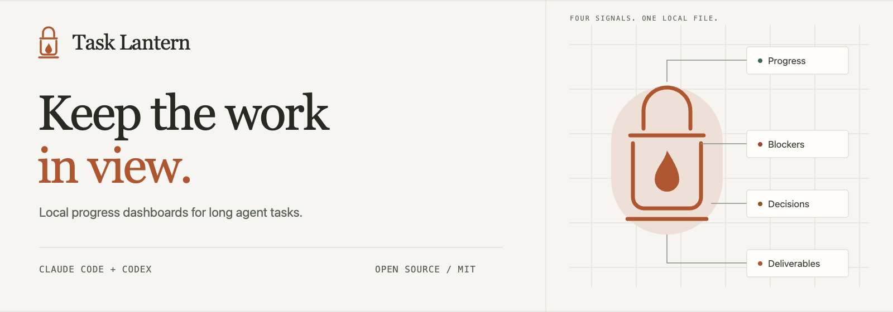
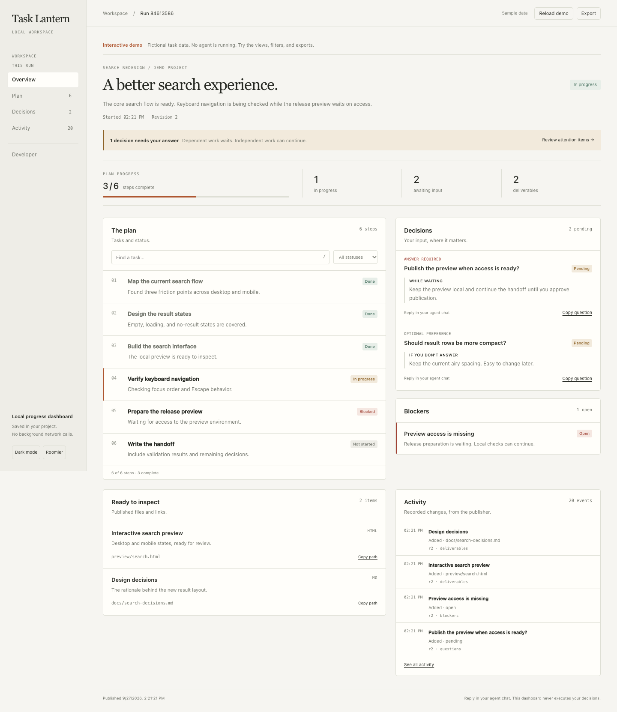

<p align="center">
  
</p>

<p align="center">
  <strong>A local progress dashboard for Claude Code and Codex.</strong><br>
  See what’s done, what’s stuck, and what needs your decision.
</p>

<p align="center">
  <a href="https://github.com/paranjaymundra/task-lantern/actions/workflows/ci.yml"></a>
  · <a href="LICENSE">MIT licensed</a>
  · Python 3.10+
</p>

<p align="center">
  <a href="#install-globally">Install</a> ·
  <a href="#try-it-first">Demo</a> ·
  <a href="#the-workbench">Features</a> ·
  <a href="docs/testing.md">Test it yourself</a> ·
  <a href="docs/installation.md">Setup & troubleshooting</a> ·
  <a href="CONTRIBUTING.md">Contribute</a>
</p>

Task Lantern is a pair of agent skills, an optional dashboard designer, and a
Python publisher. Your coding agent records its progress; Task Lantern turns
those updates into a single HTML file you can open beside your editor.

Use it for refactors, migrations, debugging investigations, and other work with
several moving parts. It runs locally without a server, telemetry, or extra
service account. Your coding agent’s normal usage costs still apply.

## Install globally

**Install once for your user, then use it in any project on that machine.**
Each project keeps its own dashboards in `.dashboard/`. No `sudo` is needed.
You need Python 3.10+, a JavaScript-enabled browser, and Claude Code or Codex.
On Windows, use `py -3` if `python3` is unavailable.

### Codex

```sh
git clone https://github.com/paranjaymundra/task-lantern.git
cd task-lantern
python3 scripts/install.py --host codex --scope user --with-agent --apply
```

This copies the skills to `~/.agents/skills/` and the optional designer to
`~/.codex/agents/`. Omit `--apply` to preview the exact paths first.
Start a new Codex session in the project you want to work on, then prompt:

```text
Use $task-lantern to track this task: [describe your task].
Use dashboard-builder in the background if available. Share the dashboard path.
```

### Claude Code

```sh
claude plugin marketplace add paranjaymundra/task-lantern
claude plugin install task-lantern@task-lantern-marketplace --scope user
```

Start a new Claude Code session in your project, then prompt:

```text
/task-lantern:task-lantern Track this task: [describe your task]. Use dashboard-builder in the background if available and share the dashboard path.
```

Prefer native Claude skills, a project-only install, or no designer subagent?
See [installation options](docs/installation.md). Choose one method per host to
avoid duplicate skills. The bundled Claude designer uses Opus at medium effort;
the native agent file can be customized for your budget.

### Use it for long tasks automatically

Global installation makes the skill available everywhere. To ask your agent to
select it for tasks with **more than five steps or an expected duration over
30 minutes**, add the [optional long-task rule](docs/long-task-rule.md) to your
user-level instructions. Installation does not edit those instructions.
This trigger is guidance to the agent; explicit invocation is the reliable way
to request a dashboard for a particular task.

## Try it first

After cloning, double-click [`examples/demo.html`](examples/demo.html).
GitHub shows HTML source; open the downloaded file in your browser.
**No agent session or installation is needed to explore the demo.**



*Actual generated dashboard; the sample task and deliverables are fictional.*

Try the Plan filters, Decisions view, dark mode, and Export menu. Open Developer
to inspect the underlying state. For a real session and a local publisher test,
follow [Test it yourself](docs/testing.md).

## The workbench

| View | What you get |
| --- | --- |
| **Overview** | Progress, attention needed, blockers, and deliverables. |
| **Plan** | Searchable tasks, status filters, and `/` to jump to search. |
| **Decisions** | Required answers first; optional choices show their default action. |
| **Activity** | The last 100 publication events, stamped with the real system clock. |
| **Developer** | Raw snapshot, schema version, revision, patch example, and copyable commands. |

- **Open it anywhere.** One offline HTML file, responsive layout, light/dark
  themes, and compact/airy density.
- **Keep following along.** Active pages refresh every 10 seconds, preserve your
  view and filters, and flag stale updates. Refresh waits while you type or use
  a dialog; completed and paused runs stop refreshing.
- **Share a handoff.** Export Markdown or JSON, copy a status summary, copy a
  local artifact path, or open a validated HTTP(S) deliverable link.
- **Track separate runs.** `.dashboard/index.html` lists runs within your project.
- **Publish safely.** Revision checks reject stale updates. Patches preserve
  omitted rows; the CLI validates decisions and completion before saving.

<details>
<summary>Developer view, dark mode, and mobile screenshots</summary>


</details>

On first use, the agent asks for your theme, density, and accent color. Confirmed
preferences can stay with the project or be remembered across projects. The
optional designer adjusts panel order and CSS to fit the work. Browser appearance
controls change your local view; they do not overwrite saved agent preferences.

## How it works


1. The main agent creates a run and publishes the plan.
2. If supported, `dashboard-builder` customizes presentation in the background.
3. The main agent publishes verified progress after meaningful steps.
4. You open the HTML file and answer questions in the agent chat.
5. The final snapshot records the outcome and stops automatic refresh.

```text
your-project/.dashboard/
├── index.html             # All runs in this project
├── preferences.json       # Optional project style
└── <run-id>/
    ├── state.json         # Facts, revision, timestamps, recent history
    ├── presentation.json  # Optional panel composition
    ├── theme.css          # Optional custom styling
    └── index.html         # Open this in your browser
```

The page is read-only: it does not accept answers or control the agent. Optional
preferences can use a reversible default; required decisions stay pending until
answered. Silence does not authorize actions. The agent can continue independent
work while waiting.

## Scope and limits

Task Lantern reflects what the agent publishes. It does not watch processes,
inspect Git automatically, infer test results, restart stopped agents, or promise
an ETA. Refreshing the page reloads the latest published snapshot.

The generated dashboard has no network requests, analytics, or remote assets.
Your host’s normal model/data handling still applies. Add `.dashboard/` to your
project’s `.gitignore` when task data should stay out of Git; the installer does
not change your ignore rules. Review exported data before sharing it.

Designer file boundaries are instructions, not an OS sandbox. Host permissions
remain in force. Background execution and agent discovery depend on your host.
The main-agent workflow works without a designer. See [security](SECURITY.md).

This is an early **0.2.0** project. Python behavior is tested on Linux, macOS,
and Windows; browser interactions are tested in Chrome. Full autonomous
Claude/Codex sessions are not covered by the automated suite.

## Documentation and contributing

- [Installation, updates, removal, and troubleshooting](docs/installation.md)
- [Test the demo, publisher, and agent workflow](docs/testing.md)
- [CLI, patches, exports, and state migration](docs/developer-guide.md)
- [Snapshot schema and publishing protocol](skills/task-lantern/references/protocol.md)
- [Contributing and local checks](CONTRIBUTING.md) · [Changelog](CHANGELOG.md) · [Releasing](docs/releasing.md)

[MIT](LICENSE). An independent project for Claude Code and Codex. The banner is
AI-generated; dashboard screenshots are real browser captures.
[Graphics provenance](docs/assets/README.md).
